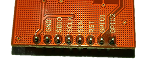
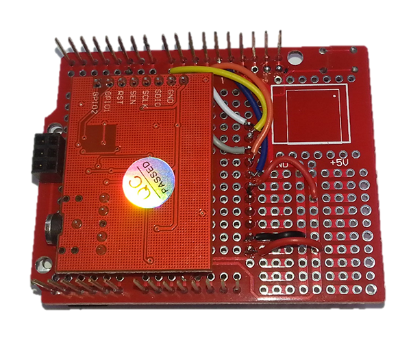

## Duinotech FM Radio

Some of the Arduino compatible modules boast amazing functionality, such as the FM Radio Module used in this project. We've had the FM Radio Module for a while now, and it was only inevitable that someone would say 'Why don't you make an FM radio project?'. Here it is, using a Leonardo main board, one of our new XC4629 colour LCD displays to show status information, and a pair of tactile switches for controls.


## Shopping List:

|Qty| Code | Description |
|---|---|---|
|1 | [XC4430](http://jaycar.com.au/p/XC4430) | Leonardo main board
|1 | [XC4629](http://jaycar.com.au/p/XC4629) | 128x128 Colour LCD Display Module
|1 | [XC4482](http://jaycar.com.au/p/XC4482) | Prototyping shield
|1 | [XC4595](http://jaycar.com.au/p/XC4595) | FM Radio Module
|1 | [SP0722](http://jaycar.com.au/p/SP0722) | Snap action switch
|1 | [RR0588](http://jaycar.com.au/p/RR0588) | 4.7k resistor

You'll also need about a metre of wire to make the connections on the Prototyping Shield- we used some pieces of [WC6028 Jumper Leads](https://jaycar.com.au/p/WC6028) to help colour code. As with just about any project that uses the prototyping shield, there is some soldering required.

## Construction:

You might look at the photo and ask where the FM Radio Module is hidden- it's actually mounted underneath the prototyping shield. This is why we're using the Leonardo- the main IC on the Uno would be too big to allow the prototyping shield to be fitted. Having modules on both sides of the board makes construction a bit fiddly.

Here's the connections that have to be made:

|Leonardo/ Shield|FM Radio Module|LCD Display Module|Buttons|Function
|---|---|---|---|---
|GND|GND|GND|Both|Ground Connection
|3.3V|VCC|||3.3V power
|5V||VCC and LED||5V power
|SCL|SCLK|||I2C Clock
|SDA|SDIO|||I2C Data
|D5|RST (via resistor)|||FM Radio reset
|D6|||Button 1|Up Button
|D7|||Button 2|Down Button
|D8||RST||Display Reset
|D9||RS||Display Register Select
|D10||CS||Display Chip Select
|D11||SDI||Display Data
|D13||CLK||Display Clock

The first step is to take the FM Radio Module and bend the pins straight up. This will allow it to lie straight underneath the Prototyping Shield.


Then we solder the FM Radio Module to the underside of the Prototyping Shield. Note the position and orientation. The pins of the FM Radio Module will be adjacent to pins D3-D9 on the Prototyping shield. To avoid the risk of things shorting out, solder the pins so that the only point the two boards are touching are at the pins themselves.


Before we solder in the LCD Display Module, we'll run the wires for the FM Radio Module. One connection is also made by a 4.7kOhm resistor, as the FM Radio Module is a 3.3V board. This connection is from D5 to the RST pin on the FM Radio Module. They're right next to each other, so it might be easiest to cut one of the resistor leads short and solder it in place, then bend, cut and solder the other leads. After that, you can make the other four connections between the Prototyping Shield and the FM Radio Module with offcuts of wire. You might find that the FM Radio Module pin markings are hidden- from left to right in the picture below, they are VCC (might not be marked on the module), GND, SDIO, SCLK, SEN, RST, GPIO1 and GPIO2.




Now we can mount the LCD Display Module. We've mounted ours so that the top of the display is level with the top of the Prototyping Shield, and we soldered it lying upside-down, so that LCD Display Module is flush with the top of the headers, and there's a gap behind it for the wires we've already soldered.


The next step is probably the fiddliest, and we found it easiest to solder the wires at the digital pin ends first, before attaching to the display. Note that we've used the 5V and GND connections on the prototyping area below the display, as they're much easier to get to. Here's a photo of the connections on the LCD Display Module, in case you can't see them.




The second last step in the construction, which should be a bit easier, is to mount and wire up the two push buttons. We solder them with two of their pins on the GND prototyping area above, so we only need to wire the other side. These are the two orange wires looping around the bottom of the Prototyping Module in the photo below. Note the orientation of the flat on the side of the button should be vertical, otherwise the button will behave like it's pushed down all the time.


The final step is the easiest- just plug the Prototyping Module into the Leonardo Board, and plug a set of headphones into the headphone socket (this will also be our antenna).

## Sketch:

For this sketch, we weren't happy with the libraries that existed for the FM Radio Module and the LCD Display Module, so we custom wrote our own. And rather than having to install them, just extract and copy the whole Duinotech_FM_Radio_for_Leonardo folder and its contents to your Documents/Arduino folder. If you'd like to use these libraries for other projects, you can just copy them to the new sketch folder.

Choose the Leonardo board and its serial port from the Tools Menu, then click Upload. After a few seconds, the display should clear and then display the frequency, volume and signal strength indicators. If the display doesn't light up or show anything at all, then there may be an issue with the display wiring. You should get some faint static and a low reading on the SIG: indicator if the FM Radio Module is working. If this isn't the case, then the wiring on the FM Radio Module should be checked. A long press on the right button should cause the frequency to slowly increase, while a short a tap will make the volume increase. The left button has the same function, except it will cause a decrease in volume or frequency. If either button doesn't seem to be working, check its wiring.

## Improvements:

Simplicity was the key in building this project, which means there is lots of scope for customization and improvement. The two easiest changes to make are to change the startup frequency and volume settings- this is done in these two lines near the start of the main sketch file:

```c
int freq=880;   //initial value, set to your favourite!
int vol=5;
```

Frequency is in multiples of 100kHz, so set freq=953 for 95.3MHz, for example. Volume ranges from 0-15.

Another feature that's easy to customize is the colour scheme. The following lines set the foreground, background and shade colours:

```c
#define FGCOLOUR WHITE
#define BGCOLOUR (BLUE_1*20)
#define SHCOLOUR GREY
```

You can use the following shortcut names: WHITE, BLACK, GREY, BLUE, RED, GREEN, YELLOW, CYAN or MAGENTA. If you're comfortable working with binary, you can use a 16-bit value, where the bits are arranged `RRRRRGGG` `GGGBBBBB`.

Apart from space limitations, there's no reason you can't add more buttons with different functions. Pins A0-A5 and D0, D1 and D4 are unused and could be used for extra inputs (it might not look like D2 and D3 are used, but they are actually shared with SDA and SCL on the Leonardo).

We've hard-wired the LED pin on the LCD Display Module to 5V, but it can also be run off a digital pin if you want to control the LED backlight in your program. This would be handy if you're looking at creating a battery-powered variation of this project.
